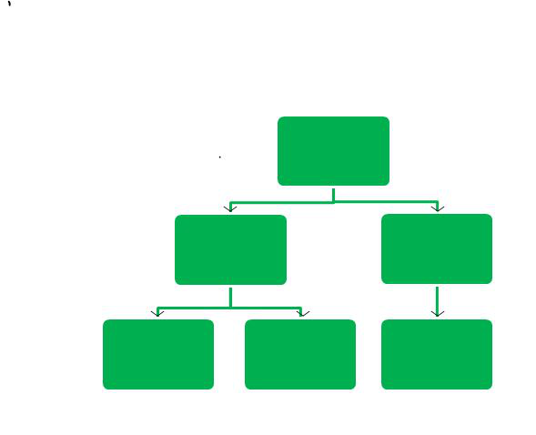
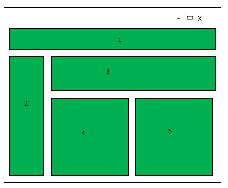
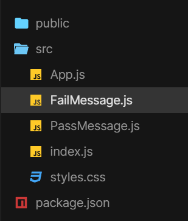

 [**History of React.js**](https://www.geeksforgeeks.org/what-are-the-features-of-reactjs/)

1) Initial Development (2011-2012):

    *Created by Facebook:* React.js was developed by Facebook and first deployed on the Facebook News Feed in 2011.
    *Open Source Release:* React was open-sourced in March 2013 at JSConf US.

2) Early Growth and Adoption (2013-2015):
    
    *Version 0.3 to 0.14:* The early versions of React introduced fundamental concepts such as components, JSX, and the virtual DOM.
    *React Native:* In 2015, Facebook released React Native, enabling developers to build mobile applications using React.

3) Component and Ecosystem Expansion (2016-2018):
    
    *React 15 & 16:* Significant updates included React 15 (2016) and React 16 (2017). React 16 introduced a complete rewrite of the core algorithm, known as the Fiber architecture, improving the performance and enabling new features
    *Context API:* React 16.3 introduced the Context API for easier state management across components.
    *Concurrent Mode:* Initial experimentation with concurrent features began in React 16.8.

4) Mature Features and Widespread Adoption (2019-Present):
    *React 16.8 (Hooks):* React 16.8, released in February 2019, introduced Hooks, allowing developers to use state and other React features without writing a class.
    *React 17:* Released in October 2020, focused on making it easier to upgrade React applications by not introducing new features and instead improving the upgrade process.
    *React 18:* Released in March 2022, introduced Concurrent Mode, automatic batching, and new features for improved performance and user experience.

We will discuss about the following featured of React:

**Table of Content**

* JSX(JavaScript Syntax Extension):
* Virtual DOM:
* One-way Data Binding:
* Performance:
* Extension:
* Conditional Statements:
* Components:
* Simplicity:

1) JSX(JavaScript Syntax Extension):
   JSX is a combination of HTML and JavaScript. You can embed JavaScript objects inside the HTML elements. JSX is not supported by the browsers, as a result, Babel compiler transcompile the code into JavaScript code. JSX makes codes easy and understandable. It is easy to learn if you know HTML and JavaScript.

   const name="GeekforGeeks";
   const ele = <h1>Welcome to {name}</h1>;

2) Virtual DOM:
    DOM stands for Document Object Model. It is the most important part of the web as it divides into modules and executes the code. Usually, JavaScript Frameworks updates the whole DOM at once, which makes the web application slow. But react uses virtual DOM which is an exact copy of real DOM. Whenever there is a modification in the web application, the whole virtual DOM is updated first and finds the difference between real DOM and Virtual DOM.

[alt text](image.png)

    In the above-shown figure, when the whole virtual DOM has updated there is a change in the child components. So, now DOM finds the difference and updates only the changed part.

3) One-way Data Binding:
    One-way data binding, the name itself says that it is a one-direction flow. The data in react flows only in one direction i.e. the data is transferred from top to bottom i.e. from parent components to child components. The properties(props) in the child component cannot return the data to its parent component but it can have communication with the parent components to modify the states according to the provided inputs.

    
    One-way Data Binding

    As shown in the above diagram, data can flow only from top to bottom.

4) Performance:
    As we discussed earlier, react uses virtual DOM and updates only the modified parts. So , this makes the DOM to run faster. DOM executes in memory so we can create separate components which makes the DOM run faster.

5. Extension:
    React has many extensions that we can use to create full-fledged UI applications. It supports mobile app development and provides server-side rendering. React is extended with Flux, Redux, React Native, etc. which helps us to create good-looking UI.

6. Conditional Statements:
    JSX allows us to write conditional statements. The data in the browser is displayed according to the conditions provided inside the JSX.

    const age = 12;
    if (age >= 10)
    { 
        
 Greater than { age } 
;
    } 
    else 
    { 
        
 { age } 
;
    }

7. Components:
    React.js divides the web page into multiple components as it is component-based. Each component is a part of the UI design which has its own logic and design as shown in the below image. So the component logic which is written in JavaScript makes it easy and run faster and can be reusable.

    

8. Simplicity:
    React.js is a component-based which makes the code reusable and React.js uses JSX which is a combination of HTML and JavaScript. This makes code easy to understand and easy to debug and has less code.

*Steps to Create React Application:*
    Step 1: Create a react application by using the following command:
    npx create-react-app foldername
    Step 2: Change your directory to the newly created folder.
    cd foldername
    Project Structure:
    
    Example: This example uses props data to demonstrate condiotional rendering in react

    Step to Run the application: Open the terminal and type the following command.
    npm start
    Output: If you give the value of isPass={true} in index.js, then it will give the following output:

**Other detail from class notes**

    ==> DOM - Documet object model.
    ==> FB developed React.js in 2013
    ==> Reacts.js is a library, we used javascript and html in it simultaneously that aims to simplify the intricate process of building interactive user interfaces.
    ==> Imagine a user interface built with React as a collection of components, each responsible for outputting a small, reusable piece of HTML code. Components are like a functions
    ==> Imagine a user interface built with React as a collection of components, each responsible for outputting a small, reusable piece of HTML code.
    ==> "React’s primary role in an application is to handle the view layer of that application just like the V in a model-view-controller (MVC) pattern by providing the best and most efficient rendering execution." https://blog.hubspot.com/website/react-js
    ==> Rather than dealing with the whole user interface as a single unit, React.js encourages developers to separate these complex UIs into individual reusable components that form the building blocks of the whole UI
    ==> Rather than dealing with the whole user interface as a single unit, React.js encourages developers to separate these complex UIs into individual reusable components that form the building blocks of the whole UI

Read this article to check how react.js works "What does React.js do?" https://blog.hubspot.com/website/react-js

    ==> Reacts used for front end development only
    ==> ChatGPT has been made by using real library
    ==> Next.js is a framework
    ==> React has its own system of navigation
    ==> React Router: Create React App doesn't include page routing.React Router is the most popular solution.
    ==> Library is used to make application interface b/c of having pre-define code in react.js (library).
    ==> DOM ==> Page reloading ==> virtual DOM and Real DOM
    ==> DOM changes functionalities of your website render it and change it into user interface.
    ==> Virtual DOM get changes first and compare with real DOM and only that part of website update after render page doesnot reload, this is due to React.js.

Component: It is like building block. Module concept follow here

**Next.js**
    ==> It is a framework
    ==> next.js overcomes react.js faults by introducing fullstack framework and its make fullstack websites

    For more info learn from here [Next.js GitHub Repo by Sir Zia Khan](https://github.com/panaverse/learn-nextjs/)

    ==> Client ==> Interface ==> medium or frontend ==> CMD

    *Bolierplate*
    ==> A boilerplate in React is a well-structured, pre-configured template or a set of best practices that developers can use as a kick-start for their react projects. It includes a predefined folder structure, development server, and all the dependencies required to run a react application.
    ==> Working on existed project is called customization
    ==> to create customization project we have a client [npx-create-next-app](#)
    ==> LTS in node.js means long term service
    ==> To see created project [npm run dev]
    ==> See themeforest for themes ==> for UX/UI
