# **Event Handling**
 Imagine you're playing with a toy that has buttons—like a little robot. When you press one button, the robot's eyes light up. When you press another, it says, "Hello!" That pressing is what we call an event.
 Now, in ReactJS and Next.js (which is like React's friend), we tell the computer what to do when you press those buttons. This is called event handling.
 Event handling in React allows your app to respond to user actions like clicks, typing or submitting a form. It's how you make your app interactive

 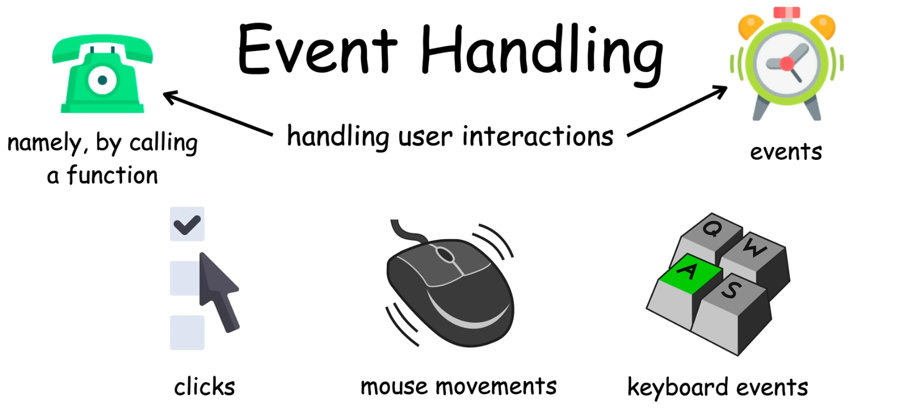
 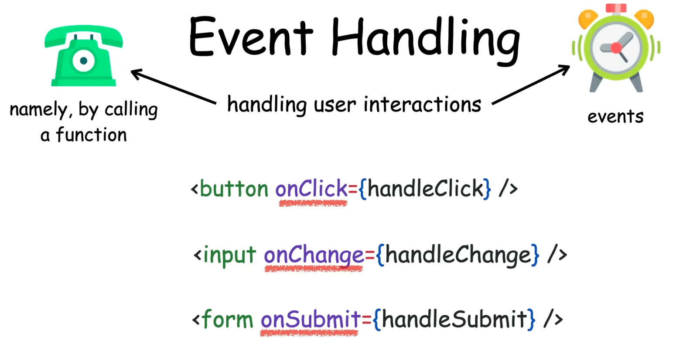
 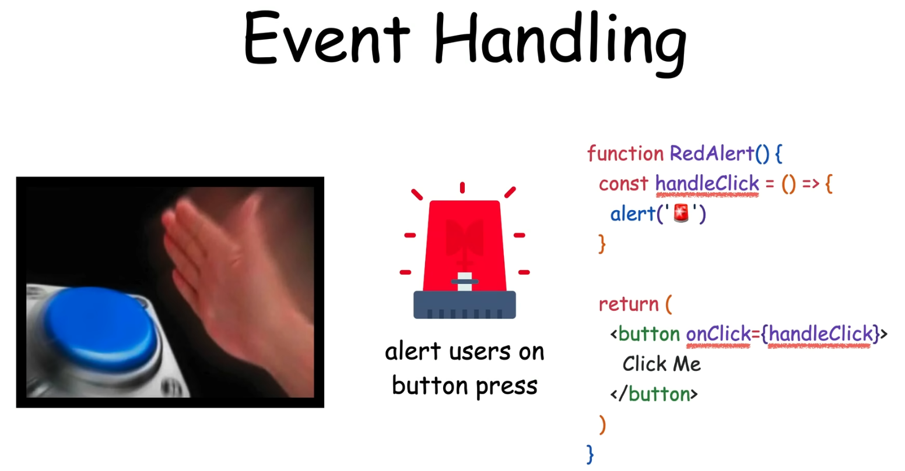

## **How it works:**
1) ### Event: 
It’s like pressing the robot's button. An event could be a click, typing something, or moving the mouse.

2) ### Handler: 
It's like telling the robot what to do when you press the button. You say, "Hey robot, when I press this button, I want you to light up your eyes!" That’s what we do with code.

Let's break each one down clearly for you!
1) ## **onClick Event Handler**
The onClick event handler is used when you want to do something when a user clicks an element, like a button.
### **Key Details:**
* *Triggered when:* The user clicks an element (button, link, div, etc.).
* *Where to use:* You can use onClick on buttons, images, divs, or even custom components.
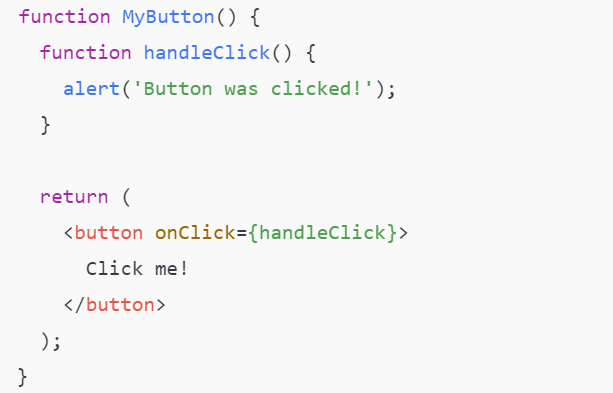
### **Explanation:**
* *onClick={handleClick}:* This tells React to call the handleClick function when the button is clicked.
* *Inside the function (handleClick):* You can define what should happen when the user clicks. Here, it shows an alert, but you could do anything—like changing a value, opening a popup, etc.

2) ## **onChange Event Handler**
The onChange event handler is used for form elements (like inputs or text areas). It tracks when the user changes something, like typing in a text field or selecting an option.
### **Key Details:**
* *Triggered when:* The user changes the value of an input field, checkbox, radio button, select dropdown, etc.
* *Where to use:* Use it with form elements, like <input>, <textarea>, and <select>.
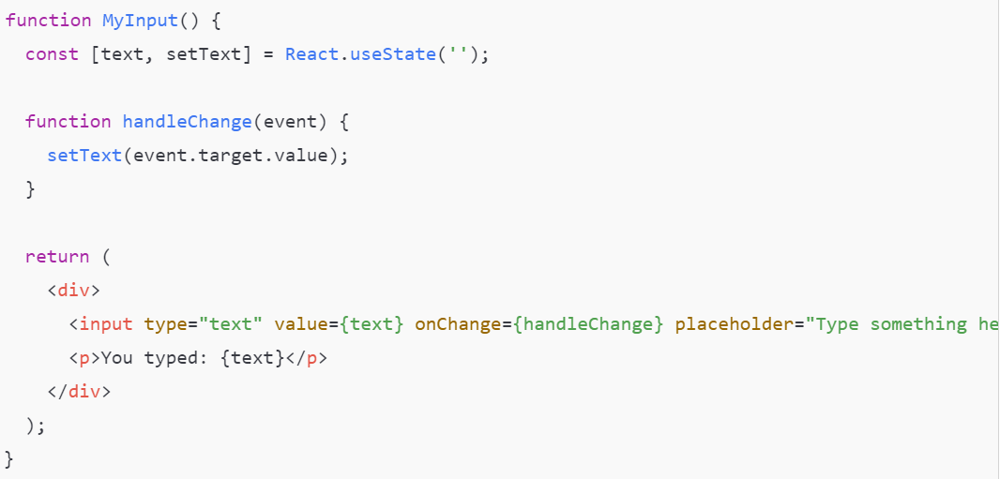
### **Explanation:**
* *onChange={handleChange}:* This tells React to call the handleChange function whenever the user types or changes the input value.
* *event.target.value:* This gets the current value of the input field. We use setText to update the state (text).
* *Controlled Component:* Notice how the <input> has a value prop set to the state (text). This makes it a controlled component. React controls the value of the input.

3) ## **onSubmit Event Handler**
The onSubmit event handler is used to handle form submissions. When a user presses a submit button (or hits "Enter" inside a form), this event is triggered.
### **Key Details:**
* *Triggered when:* A form is submitted (either by pressing "Enter" or clicking the submit button).
* *Where to use:* Use it on a <form> element.
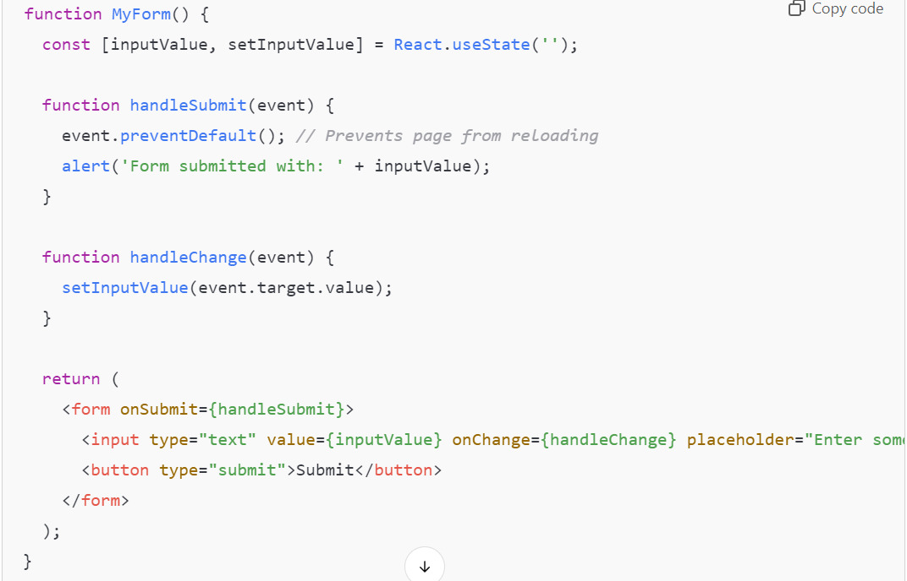
### **Explanation:**
* *onSubmit={handleSubmit}:* This tells React to call handleSubmit when the form is submitted.
* *event.preventDefault():* Normally, forms reload the page when submitted. event.preventDefault() prevents this default behavior, letting us handle the form submission with React (like showing an alert or sending data to a server).
* *Form control:* Like the onChange example, the input is a controlled component because its value is managed by React.

## **Differences in React and Next.js:**
* In both ReactJS and Next.js, these event handlers work the same way since Next.js is built on top of React.
* Next.js may come with additional server-side logic (like API routes or data fetching), but handling these events client-side (clicking, changing, or submitting) behaves identically in both.

## **Key Takeaways:**
* ***onClick:*** Handles clicks on buttons or other elements.
* ***onChange:*** Tracks changes in input fields, useful for forms.
* ***onSubmit:*** Handles the full form submission and can be used to prevent default browser behavior (like page reload).
___
# **Controlled Components**
Controlled components are form elements in React whose values are controlled by the State. This means the value of input field is driven by the react state
A controlled component in React refers to a form element (like an <input>, <textarea>, or <select>) where React fully controls the value of that element using state. In other words, the form element's value is determined and managed by React’s state rather than the DOM itself. The component only updates when React changes its state.
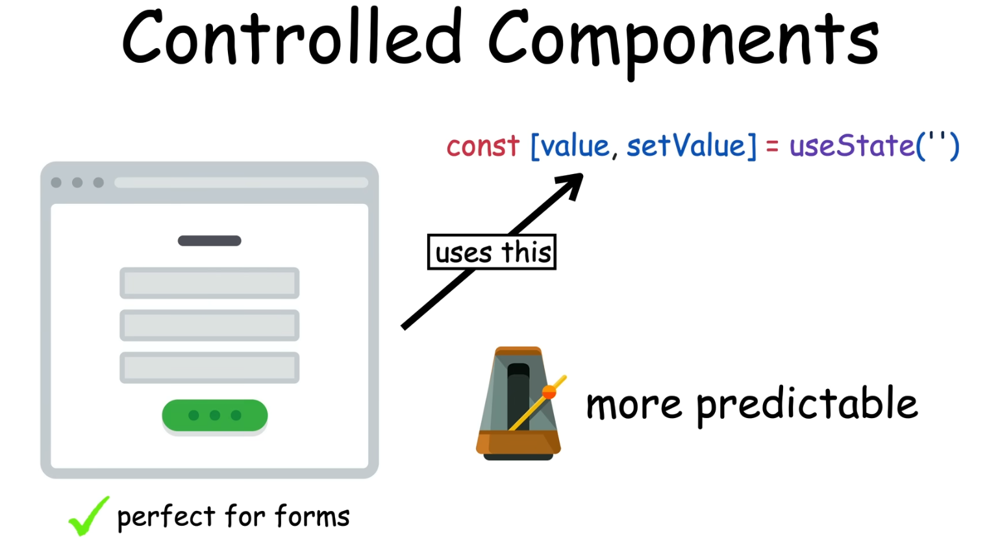
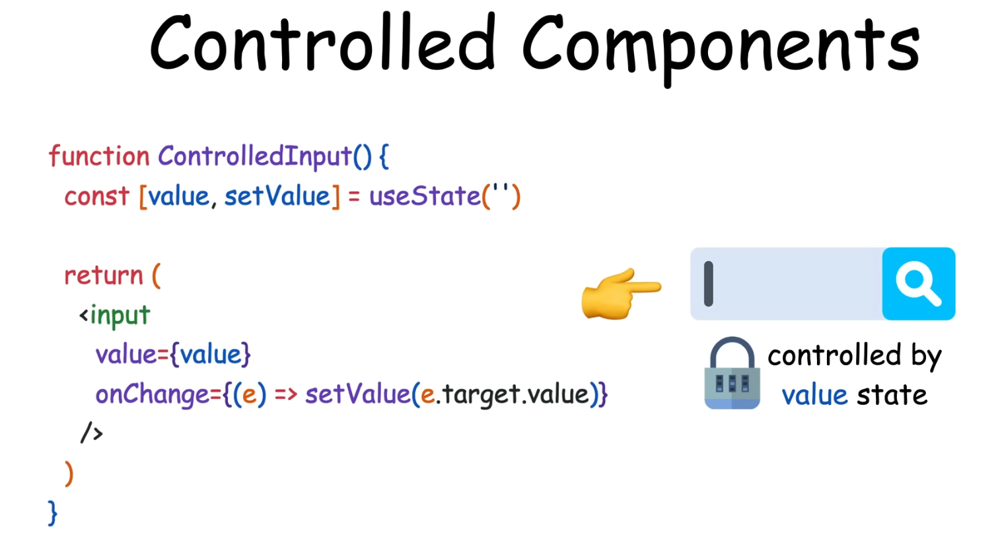
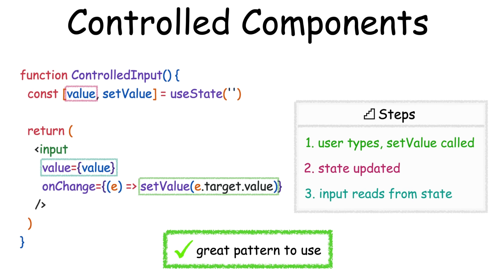

## **How It Works:**
* *State in React:* The value of the form element is stored in the component's state.
* *Event Handling:* An event handler, like onChange, updates the state whenever the user interacts with the form element (like typing or selecting).
* *Rendering:* React re-renders the component whenever the state changes, making the form element's value reflect the current state.

## **Why is it called "controlled"?**
It’s called a "controlled" component because React controls the value and behavior of the form element. The input element’s value doesn’t change unless React’s state updates.**

## **Example of a Controlled Component:**
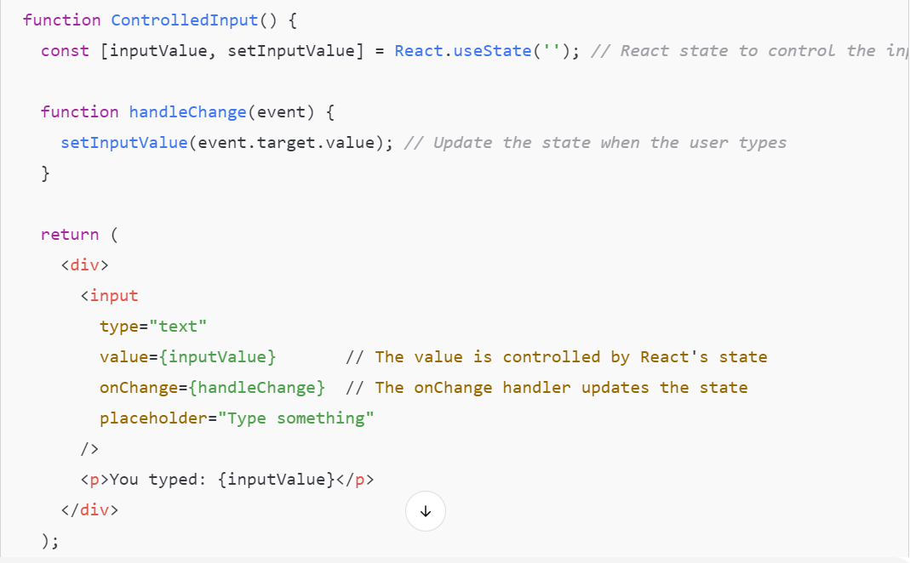

## **Key Aspects:**
* *value={inputValue}:* The <input> field’s value is tied to the React state inputValue. The state controls what is shown in the input box.
* *onChange={handleChange}:* The onChange event handler updates the state whenever the user types in the input box. It ensures that the input box always reflects the state.

## **Why Use Controlled Components?**
1) *Single Source of Truth:* The component's state is the single source of truth for the form element's value, which means you can easily manage and track changes.
2) *Validation:* You can validate the input in real-time by controlling it in the state.
3) *Data Synchronization:* Since the data in the form is synced with the component's state, it makes it easier to submit data, manipulate form fields, or track user inputs.

## **Controlled Component vs Uncontrolled Component:**
1) *Controlled:* React’s state controls the form value (you provide both the value and onChange).
2) *Uncontrolled:* The form value is controlled by the DOM, not by React (you rely on the ref to get the value).

## **Example of Uncontrolled Component:**
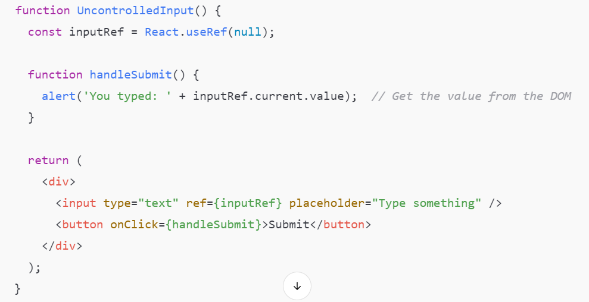

## **Summary of Controlled Components:**
* **React controls the value** of the form element via state.
* The value updates only when **React's state updates.**
* Easier to handle, validate, and manipulate form data as everything is centralized in the component’s state.